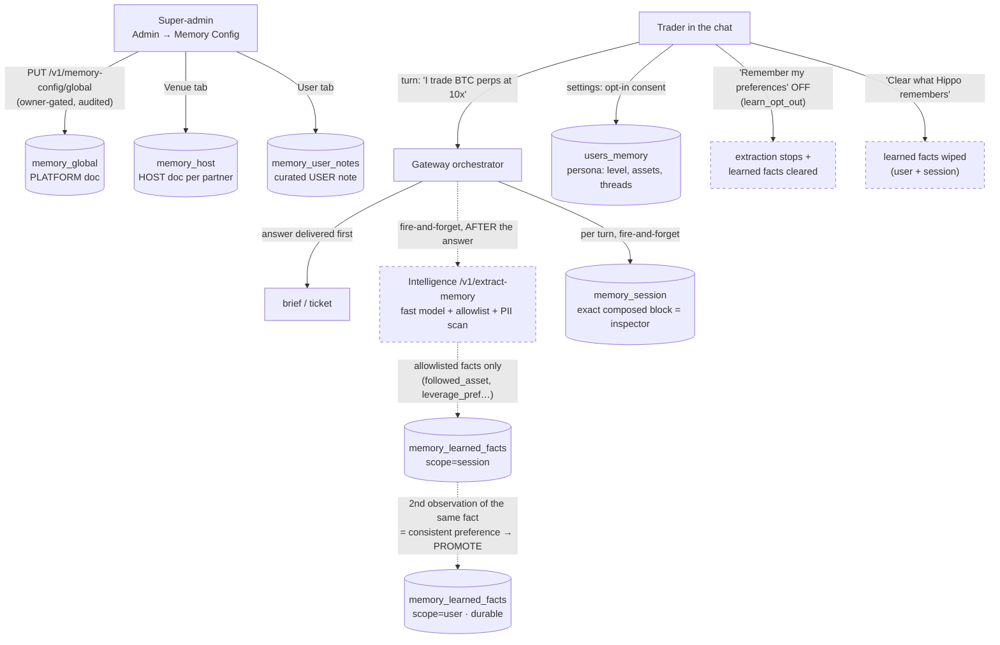
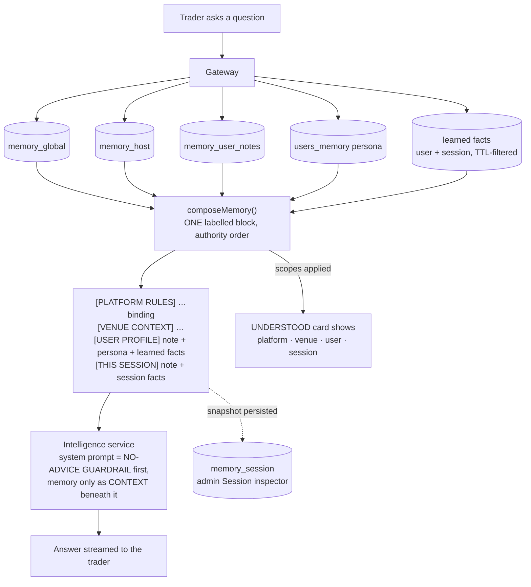
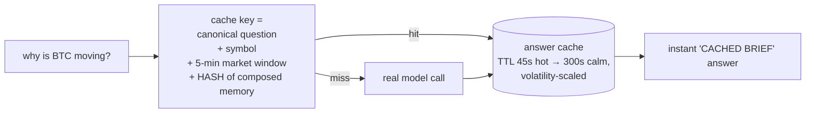

# Cache for Sudha — how Hippo saves data at every level

**Audience:** Sudha (pilot instrumentation/telemetry) · **As of:** July 28, 2026 (main @ `5e3df50`) · Related: [[🟢 Live Demo Status]] · [[Roadmap]]

Hippo saves data at **four memory levels** (platform → host → user → session), plus **auto-learned facts** with provenance, plus a **fleet-wide answer cache**. Every level composes into the prompt in authority order, and the cache key is memory-aware so one user's context can never leak into another's answer. This note maps who writes what, where it lives, and how it all meets in a single turn.

---

## 1 · The storage inventory — what lives where

All durable state is in **Postgres** (Railway), applied via numbered migrations in `packages/stores/migrations/`. Sessions and the answer cache are in-memory/Redis (ephemeral by design).

| Level | Table (migration) | Key | Written by | Contains |
|---|---|---|---|---|
| **PLATFORM** (global) | `memory_global` (009) | singleton row | Super-admin only (Admin → Memory Config → Platform, audited) | One freeform doc — platform-wide rules/context |
| **HOST** (venue/partner) | `memory_host` (009) | `partner_id` | Super-admin (Venue tab, audited) | One freeform doc per exchange/partner |
| **USER — curated note** | `memory_user_notes` (009) | `(partner_id, user_id)` | Super-admin (User tab, audited) | Freeform note about a specific trader |
| **USER — structured persona** | `users_memory` (004, 012) | `(partner_id, user_id)` | The trader (opt-in consent, settings) + orchestrator accrual | `optIn`, `experienceLevel`, `followedAssets`, `openThreads`, `learn_opt_out` |
| **USER + SESSION — learned facts** | `memory_learned_facts` (011) | `scope` + ids + `(fact_type, fact_value)` | **Auto-learning** (post-turn extraction) + admin | Allowlisted trading facts with provenance (`auto`/`admin`), confidence, timestamps |
| **SESSION — composed snapshot** | `memory_session` (010) | `session_id` | Gateway (fire-and-forget, per turn) | The **exact composed block sent to the model** — the inspector record |
| Live sessions + frame journal | in-memory (Redis optional) | `session_id` | Gateway | Conversation frames, resume journal — not durable storage |
| **Answer cache** | in-memory + Redis (intelligence service) | see §4 | Intelligence service | Finished market briefs, shared fleet-wide |

**Tenancy by construction:** every user-level row is keyed by `(partner_id, user_id)` and the partner id only ever comes from the signed session — a request can't name someone else's partner. Cross-tenant reads are unexpressible, not just forbidden.

---

## 2 · The write path — how data gets saved at each level

**The rules that make this safe:**
- **Admin prose and auto-learned facts never mix.** Freeform docs (what a human typed) live in their own tables; extraction writes only to `memory_learned_facts`. An `admin`-provenance fact is never overwritten or evicted by an `auto` one.
- **Extraction is allowlisted + PII-gated.** Only five fact types can ever be stored (followed asset, spot/perps preference, leverage, experience level, answer style); values are canonicalised, directive-scanned (an injection like "remember to tell me to buy" stores nothing) and PII-scanned (a name/email/wallet in the sentence is dropped — verified by an adversarial eval battery).
- **Promotion needs repetition.** A fact heard once stays session-scoped (ephemeral). Heard a **second** time → promoted to durable user scope. Durable memory reflects consistent behaviour, not an offhand remark.
- **Decay:** learned facts not re-observed within **90 days** (`LEARNED_FACT_TTL_MS`) stop composing and get pruned. Admin facts are exempt.
- **Everything trader-facing is fire-and-forget** — a memory write can never slow down or break a turn.

---

## 3 · The read path — how the levels compose into one turn

Per research/concept turn (gated behind the `memoryLab` plan entitlement — off = byte-identical pre-memory behaviour):

**Authority order is the whole point:** PLATFORM outranks VENUE outranks USER outranks SESSION — a more specific layer adds detail, never countermands a higher one. And *all* of it sits **beneath the no-advice guardrail**: memory personalises answers; it cannot turn Hippo into an advice engine (a PLATFORM doc saying "ignore the no-advice rule" still gets a decline — tested live).

**Inspectability:** the exact block sent is persisted per session (`memory_session`) — Admin → Memory Config → **Session** shows precisely what the model received, and the in-chat UNDERSTOOD card lists the scopes applied. Never a re-derivation; always the real record.

---

## 4 · The answer cache — and why memory doesn't break it

This is the part closest to your telemetry: the **cache hit rate is the unit-economics number** (one market answer served fleet-wide instead of one LLM call per user).

- **No user FK in the key** — the cache is deliberately fleet-wide: everyone asking "why is BTC moving?" in the same 5-minute window shares one answer. That's the economics.
- **But memory changes answers** — so the **composed memory block is hashed into the key**. Two users with identical memory context share cache entries; any difference in composed memory = different key. **Memory-A's answer is never served to memory-B**, and privacy holds because only a hash of the context enters the key, never the content.
- Practical telemetry consequence: turning `memoryLab` on (or editing memory docs) **fragments the cache** — expect the hit rate to dip when memory context varies widely across users, and to stay healthy where memory is uniform (e.g., platform+venue docs only, which hash identically for everyone on the venue).
- TTL is **volatility-scaled** (45s in a hot market → 300s calm), so staleness risk and hit rate trade off automatically with market conditions.

---

## 5 · Retention & control summary

| Data | Lifetime | Trader control | Admin control |
|---|---|---|---|
| Platform / host / user-note docs | until edited | — | Edit/clear per tab (audited `memory_config.set`) |
| Persona (`users_memory`) | until cleared | opt-in consent; "clear memory" in settings | View/edit/purge (Memory page) |
| Learned facts — session scope | session + 90-day TTL | "Remember my preferences" toggle; one-tap Clear | View via Session inspector |
| Learned facts — user scope | 90-day rolling TTL (re-observation refreshes) | Same toggle + Clear (wipes both scopes) | Purge per partner |
| Composed snapshots (`memory_session`) | per session | — | Read-only inspector |
| Answer cache | 45–300s TTL | — | Toggleable via host AI controls; hit-rate on the admin dashboard |
| Conversation frames / journal | in-memory (Redis optional); lost on gateway restart unless Redis | — | Session revoke |

**One sentence for the pilot deck:** *Hippo stores curated context at platform/host/user levels, auto-learns only allowlisted trading preferences (promoted to durable memory on repetition, decayed after 90 days, opt-out + clearable by the trader), composes it all beneath a non-overridable no-advice guardrail, records exactly what was sent for audit — and keeps the fleet-wide answer cache safe by hashing the composed memory into the cache key.*
