# Hippo — Data Model (ER Diagram)

**Snapshot:** July 20, 2026 · derived from `hippo-app@main` (`19e79f5`). Every entity below maps to a real type in the code — the owning file is named in the legend. For the service-level view see [[Development Documentation]]; for the plan see [[10 BE Architecture]].

Hippo has **no single database**. Each service owns its own entities behind an interface, so the "tables" here live in five bounded contexts (**gateway · memory · intelligence · seam · control plane**) plus the CLI installer's build-time artifacts. The big change since July 16: the durable business entities (partners, plans, users, MAU, operators, portal logins) now live in **`packages/stores` over Postgres** — a numbered-SQL migration set (`001`–`008`), not per-service in-memory maps. The diagram shows the *logical* model — the relationships hold regardless of backing store.

## The diagram

```mermaid
erDiagram
    %% ── Control plane / tenancy (packages/stores → Postgres) ────
    PLAN ||--o{ PARTNER : "assigned to (planId)"
    PARTNER ||--o{ USER : "registers end-users"
    PARTNER ||--o{ MAU_EVENT : "counts (per month)"
    PARTNER ||--o{ PARTNER_ADMIN : "portal logins for"
    OPERATOR ||--o{ CONTROL_AUDIT : "acts (admin console)"
    PARTNER_ADMIN ||--o{ CONTROL_AUDIT : "acts (partner portal)"

    %% ── Identity & session (services/gateway) ──────────────────
    PARTNER ||--o{ SESSION : "opens"
    PARTNER ||--o{ PERSONA : "scopes (L1 boundary)"
    PARTNER ||--|| VENUE_ADAPTER : "bound to"
    SESSION ||--o{ JOURNAL_ENTRY : "logs (append-only)"
    SESSION }o--o| PERSONA : "recalls by partnerId+userId"
    JOURNAL_ENTRY }o--|| FRAME : "carries one"
    SESSION ||--o{ UPLINK : "receives (turns)"

    %% ── Persona / memory (services/memory) ─────────────────────
    PERSONA ||--o{ OPEN_THREAD : "remembers (cap 3)"

    %% ── Execution seam (services/seam) ─────────────────────────
    VENUE_ADAPTER ||--o{ PREPARED_TICKET : "prepares"
    VENUE_ADAPTER ||--o{ PORTFOLIO : "reads live"
    PREPARED_TICKET ||--o{ LIFECYCLE_EVENT : "emits"
    PREPARED_TICKET ||--o{ SEAM_AUDIT : "records"
    PORTFOLIO ||--o{ POSITION_ROW : "contains"
    PORTFOLIO ||--o{ OPEN_ORDER : "contains"

    %% ── Agentic installer (tools/cli — build-time) ─────────────
    ADAPTER_CONFIG ||--o{ ADAPTER_OPERATION : "maps"
    ADAPTER_CONFIG |o--|| VENUE_ADAPTER : "codegen target"

    PLAN {
        string planId PK
        string name
        string tier "pilot | growth | enterprise (free-form)"
        int mauQuota "monthly-active ceiling; null = unlimited"
        int priceMonthlyUsd "null = unpriced"
        json entitlements "feature flags passed to session config"
        ts createdAt
    }
    OPERATOR {
        string email PK "Hippo staff — internal trust domain"
        string passwordHash "scrypt salthex:keyhex; never plaintext"
        string role "owner | operator"
        ts createdAt
    }
    PARTNER_ADMIN {
        string email PK "partner staff — external, one partner only"
        string partnerId PK "the one partner this login is scoped to"
        string passwordHash "scrypt; null until invite claimed"
        string role "admin | viewer"
        string inviteTokenHash "sha256 of single-use claim token; null once claimed"
        ts inviteExpiresAt "invite validity ceiling"
        ts createdAt
    }
    USER {
        string partnerId PK
        string userId PK "authenticated venueUserId; anon dev sessions never recorded"
        ts firstSeen
        ts lastSeen
        string status "active | blocked"
    }
    MAU_EVENT {
        string partnerId PK
        string userKey PK
        string month PK "YYYY-MM — one row per distinct (partner, user, month)"
    }
    CONTROL_AUDIT {
        int id PK
        string actorEmail "operator OR partner-admin, per surface"
        string action
        string target
        json detail
        ts ts
    }
    PARTNER {
        string partnerId PK
        string partnerKey UK "public embed key (data-hippo-key)"
        string jwtSecret "HS256 shared secret; JWKS in prod"
        string venueName
        array locales "en, hi, hinglish, ar"
        array suggestedQueries "engineered cache levers"
        string planId FK "null = no quota enforcement"
        string status "active | suspended | sandbox"
        ts createdAt
    }
    SESSION {
        string id PK "s_<uuid12>"
        string partnerId FK
        string venueUserId "null for anon dev session"
        int seq "monotonic frame counter"
        ts expiresAt "30-min sliding TTL"
        string language "from settings uplink"
        bool degradedBannerShown "once per episode"
    }
    JOURNAL_ENTRY {
        int seq PK "per-session, from 1"
        string sessionId FK
        json frame "one validated protocol Frame"
    }
    FRAME {
        string type PK "discriminated union"
        int v "PROTOCOL_VERSION = 1"
        json fallback "text + href — additive-only contract"
    }
    UPLINK {
        string kind PK "user_text, chip_tap, ticket_action, feedback, consent, settings, stream_stop"
        string sessionId FK
    }
    PERSONA {
        string partnerId PK
        string userId PK
        bool optIn "data accrues only while true"
        string experienceLevel "new | intermediate | pro"
        array followedAssets "most-recent-first, cap 8"
        ts updatedAt
    }
    OPEN_THREAD {
        string text
        string symbol
        ts ts
    }
    CACHE_ENTRY {
        string key PK "canonical_q : asset : window — NO user/session FK"
        json brief
        string asOfIso "the moment the fact was true"
        number ttl "volatility-scaled 45-300s"
    }
    VENUE_ADAPTER {
        string venue PK "sim (dev) | koinbx | assetworks — selected by VENUE="
        string confirmSurface "api | js_callback (read live from venue config)"
    }
    PREPARED_TICKET {
        string ticketId PK
        string partnerId FK
        string userId
        string clientOrderId UK "reconciliation key"
        string kind "spot | futures_perp | options"
        string side "buy | sell"
        string instrument
        string orderType "market | limit"
        string limitPrice "limit only; money as string"
    }
    LIFECYCLE_EVENT {
        string ticketId FK
        string phase "awaiting_confirm | filled | partial | cancelled | expired | rejected"
        string statusLine
        string venueOrderId
        int fillPct
    }
    SEAM_AUDIT {
        ts ts
        string kind "prepare | confirm | cancel | event_delivered | event_delivery_failed"
        string ticketId FK
        string idempotencyKey UK
        string detail
    }
    PORTFOLIO {
        string partnerId FK
        string userId
    }
    POSITION_ROW {
        string instrument
        string size
        string entry
        string mark
        string pnl
    }
    OPEN_ORDER {
        string orderId
        string side
        string summary
        string status
    }
    ADAPTER_CONFIG {
        string venue PK
        string baseUrl "best guess, flagged for confirm"
        array authSchemes "hmac | bearer | api-key"
    }
    ADAPTER_OPERATION {
        string capability "quote, orderPlacement, positions, ..."
        string status "mapped | gap"
        string endpoint "e.g. POST /api/v1/trade/orders"
        bool needsMappingCode "true where shapes diverge"
    }
```

## The one entity with no relationships is the point

`CACHE_ENTRY` is deliberately keyed by `(canonical question, asset, 5-minute window)` and carries **no user or session foreign key**. That disconnection is the unit-economics engine (strategy memo §9): a market-level answer is a fact, not an opinion, so it is generated once and served fleet-wide — "why is BTC down" from 50k users in a dump collapses onto one cache entry. If this table gained a `userId`, the whole cost model would break. Its `asOfIso` is the *original* moment, so a cache hit is honest about which "now" it describes.

## The control plane is a separate trust domain

The `OPERATOR` and `PARTNER_ADMIN` tables look similar but sit on **opposite sides of the trust boundary**. `OPERATOR` is Hippo staff on the internal admin console (`services/admin`), able to see and mutate every partner. `PARTNER_ADMIN` is external partner staff on the public portal ingress (`services/portal`), scoped to **exactly one** `partnerId` that comes only from their session — never from a request body — so the portal is tenant-isolated by construction. A `PARTNER_ADMIN` row is minted by an operator invite (`passwordHash` null + `inviteTokenHash` set) and becomes usable only when the one-time invite is claimed (password set, token cleared).

## Legend — who owns what, and where it lives in production

| Entity                                         | Owning service | Source file                                                                             | Store (dev → prod)                                                                             | Scope                        |
| ---------------------------------------------- | -------------- | --------------------------------------------------------------------------------------- | ---------------------------------------------------------------------------------------------- | ---------------------------- |
| PLAN                                           | admin          | `packages/stores/src/plan-store.ts` · `migrations/002_plans.sql`                        | Postgres `plans`                                                                               | global                       |
| OPERATOR / CONTROL_AUDIT                       | admin          | `packages/stores/src/admin-store.ts` · `005_admin.sql`                                  | Postgres `operators` / `audit_log`                                                             | global                       |
| PARTNER_ADMIN                                  | portal         | `packages/stores/src/partner-admin-store.ts` · `008_partner_admins.sql`                 | Postgres `partner_admins`                                                                      | regional                     |
| USER                                           | gateway/admin  | `packages/stores/src/user-store.ts` · `003_users.sql`                                   | Postgres `users`                                                                               | regional                     |
| MAU_EVENT                                      | gateway/admin  | `packages/stores/src/mau-store.ts` · `006_mau_events.sql`                               | Postgres `mau_events` (in-process Telemetry set is the fast path; this makes it restart-proof) | regional                     |
| PARTNER                                        | gateway/admin  | `packages/stores/src/partner-store.ts` · `001_partners.sql` + `007_partner_sandbox.sql` | Postgres `partners` (gateway consumes `PartnerRecord` directly)                                | global config                |
| SESSION                                        | gateway        | `plugins/auth.ts` (`SessionStore`)                                                      | `Map` → Redis                                                                                  | regional                     |
| JOURNAL_ENTRY                                  | gateway        | `plugins/sse.ts` (`InMemoryJournal`, 500-ring)                                          | ring buffer → Redis Streams `session:{id}:frames`                                              | regional                     |
| FRAME / UPLINK                                 | protocol       | `packages/protocol/src/*.ts`                                                            | Zod schemas (the contract, not stored)                                                         | —                            |
| PERSONA / OPEN_THREAD                          | memory         | `services/memory/src/store.ts` · `004_users_memory.sql`                                 | Postgres `users_memory` (wired into the orchestrator)                                          | **regional (PII in-region)** |
| CACHE_ENTRY                                    | intelligence   | `services/intelligence/cache.py`                                                        | TTL dict → Redis `cache:{q}:{asset}:{window}`                                                  | **global (no PII)**          |
| VENUE_ADAPTER                                  | seam           | `services/seam/src/{sim,koinbx,assetworks}-venue.ts`                                    | code impl, selected by `VENUE=`                                                                | regional                     |
| PREPARED_TICKET / LIFECYCLE_EVENT / SEAM_AUDIT | seam           | `services/seam/src/{types,service}.ts`                                                  | in-memory + audit log → durable audit store (Tier-2, migration `009`)                          | regional                     |
| PORTFOLIO / POSITION_ROW / OPEN_ORDER          | seam           | `services/seam/src/types.ts`                                                            | **never cached** — read-through from the venue every time                                      | regional                     |
| ADAPTER_CONFIG / ADAPTER_OPERATION             | CLI            | `tools/cli/src/init/{types,config}.ts`                                                  | build-time YAML artifact (`hippo init` stage 3)                                                | build-time                   |

> The old `TICKET_QUOTE` (a dev-sim quote held on the session) is gone — the execution seam is now the only path to a priced ticket, so quotes come from `VENUE_ADAPTER.quote()`, not a gateway stub.

## Two boundaries the model enforces

1. **L1 data boundary (per-partner isolation).** `PERSONA` is keyed by `partnerId` *and* `userId`, so partner A's Hippo can never read what the same person asked on partner B. `PREPARED_TICKET`, `PORTFOLIO`, `USER`, `MAU_EVENT`, and `PARTNER_ADMIN` all carry the same partner scope — and the portal enforces it structurally by taking `partnerId` only from the session.
2. **Regional vs global split follows PII.** Everything user-identifiable (`SESSION`, `PERSONA`, `USER`, the seam entities) is regional; the only global tiers are `CACHE_ENTRY` (no user data — that's the whole point) and the config/tenancy tables (`PARTNER`, `PLAN`, `OPERATOR`). This is why the cache can be a single global store while memory must be sharded by region.

Related: [[Development Documentation]] · [[10 BE Architecture]] · [[12 Partner Admin Portal]] · [[01 System Architecture]] · [[Home]]
