# Hippo — Data Model (ER Diagram)

**Snapshot:** July 16, 2026 · derived from `hippo-app@main` (`f3370b3`). Every entity below maps to a real type in the code — the owning file is named in the legend. For the service-level view see [[Development Documentation]]; for the plan see [[10 BE Architecture]].

Hippo has **no single database**. Each service owns its own entities behind an interface, so the "tables" here live in four bounded contexts (gateway · memory · intelligence · seam) plus the CLI installer's build-time artifacts. Today most are in-memory dev implementations; the production store per entity is in the legend. The diagram shows the *logical* model — the relationships hold regardless of backing store.

## The diagram

```mermaid
erDiagram
    %% ── Identity & session (services/gateway) ──────────────────
    PARTNER ||--o{ SESSION : "opens"
    PARTNER ||--o{ PERSONA : "scopes (L1 boundary)"
    PARTNER ||--|| VENUE_ADAPTER : "bound to"
    SESSION ||--o{ JOURNAL_ENTRY : "logs (append-only)"
    SESSION ||--o{ TICKET_QUOTE : "holds pending (dev sim)"
    SESSION }o--o| PERSONA : "recalls by partnerId+userId"
    JOURNAL_ENTRY }o--|| FRAME : "carries one"
    SESSION ||--o{ UPLINK : "receives (turns)"

    %% ── Persona / memory (services/memory) ─────────────────────
    PERSONA ||--o{ OPEN_THREAD : "remembers (cap 3)"

    %% ── Execution seam (services/seam) ─────────────────────────
    VENUE_ADAPTER ||--o{ PREPARED_TICKET : "prepares"
    VENUE_ADAPTER ||--o{ PORTFOLIO : "reads live"
    PREPARED_TICKET ||--o{ LIFECYCLE_EVENT : "emits"
    PREPARED_TICKET ||--o{ AUDIT_ENTRY : "records"
    PORTFOLIO ||--o{ POSITION_ROW : "contains"
    PORTFOLIO ||--o{ OPEN_ORDER : "contains"

    %% ── Agentic installer (tools/cli — build-time) ─────────────
    ADAPTER_CONFIG ||--o{ ADAPTER_OPERATION : "maps"
    ADAPTER_CONFIG |o--|| VENUE_ADAPTER : "codegen target"

    PARTNER {
        string partnerId PK
        string partnerKey UK "public embed key (data-hippo-key)"
        string jwtSecret "HS256 shared secret; JWKS in prod"
        string venueName
        array locales "en, hi, hinglish"
        array suggestedQueries "engineered cache levers"
    }
    SESSION {
        string id PK "s_<uuid12>"
        string partnerId FK
        string venueUserId "null for anon dev session"
        int seq "monotonic frame counter"
        ts expiresAt "30-min sliding TTL"
        string language "from settings uplink"
        bool degradedBannerShown "once per episode"
    }
    JOURNAL_ENTRY {
        int seq PK "per-session, from 1"
        string sessionId FK
        json frame "one validated protocol Frame"
    }
    TICKET_QUOTE {
        string ticketId PK
        string sessionId FK
        string side "buy | sell"
        string instrument "BASE/USDT"
        number price
        number feeRate "dev sim; seam replaces in Phase 3"
    }
    FRAME {
        string type PK "14 variants (discriminated union)"
        int v "PROTOCOL_VERSION = 1"
        json fallback "text + href — additive-only contract"
    }
    UPLINK {
        string kind PK "6: user_text, chip_tap, ticket_action, feedback, consent, settings"
        string sessionId FK
    }
    PERSONA {
        string partnerId PK
        string userId PK
        bool optIn "data accrues only while true"
        string experienceLevel "new | intermediate | pro"
        array followedAssets "most-recent-first, cap 8"
        ts updatedAt
    }
    OPEN_THREAD {
        string text
        string symbol
        ts ts
    }
    CACHE_ENTRY {
        string key PK "canonical_q : asset : window — NO user/session FK"
        json brief
        string asOfIso "the moment the fact was true"
        number ttl "volatility-scaled 45-300s"
    }
    VENUE_ADAPTER {
        string venue PK "KoinBX (pilot) | Sim (dev)"
        string confirmSurface "api | deeplink | callback | modal"
    }
    PREPARED_TICKET {
        string ticketId PK
        string partnerId FK
        string userId
        string side "buy | sell"
        string instrument
        string orderType "market | limit"
        string limitPrice "limit only"
    }
    LIFECYCLE_EVENT {
        string ticketId FK
        string phase "awaiting_confirm | filled | partial | cancelled | expired"
        string statusLine
        string venueOrderId
        int fillPct
    }
    AUDIT_ENTRY {
        ts ts
        string kind "prepare | confirm | cancel | event_delivered | event_delivery_failed"
        string ticketId FK
        string idempotencyKey UK
        string detail
    }
    PORTFOLIO {
        string partnerId FK
        string userId
    }
    POSITION_ROW {
        string instrument
        string size
        string entry
        string mark
        string pnl
    }
    OPEN_ORDER {
        string orderId
        string side
        string summary
        string status
    }
    ADAPTER_CONFIG {
        string venue PK
        string baseUrl "best guess, flagged for confirm"
        array authSchemes "hmac | bearer | api-key"
    }
    ADAPTER_OPERATION {
        string capability "quote, orderPlacement, positions, ..."
        string status "mapped | gap"
        string endpoint "e.g. POST /api/v1/trade/orders"
        bool needsMappingCode "true where shapes diverge"
    }
```

## The one entity with no relationships is the point

`CACHE_ENTRY` is deliberately keyed by `(canonical question, asset, 5-minute window)` and carries **no user or session foreign key**. That disconnection is the unit-economics engine (strategy memo §9): a market-level answer is a fact, not an opinion, so it is generated once and served fleet-wide — "why is BTC down" from 50k users in a dump collapses onto one cache entry. If this table gained a `userId`, the whole cost model would break. Its `asOfIso` is the *original* moment, so a cache hit is honest about which "now" it describes.

## Legend — who owns what, and where it lives in production

| Entity | Owning service | Source file | Dev store → Production store | Scope |
|---|---|---|---|---|
| PARTNER | gateway | `plugins/auth.ts` (`PARTNERS`) | in-memory array → `partners` table (config, JWKS, adapter refs) | global |
| SESSION | gateway | `plugins/auth.ts` (`SessionStore`) | `Map` → Redis | regional |
| JOURNAL_ENTRY | gateway | `plugins/sse.ts` (`InMemoryJournal`, 500-ring) | ring buffer → Redis Streams `session:{id}:frames` | regional |
| TICKET_QUOTE | gateway | `plugins/auth.ts` (`TicketQuote`) | `Map` on session → **removed once seam is the only path** | regional |
| FRAME / UPLINK | protocol | `packages/protocol/src/*.ts` | Zod schemas (the contract, not stored) | — |
| PERSONA / OPEN_THREAD | memory | `services/memory/src/store.ts` | `InMemoryPersonaStore` → Postgres `users_memory` | **regional (PII in-region)** |
| CACHE_ENTRY | intelligence | `services/intelligence/cache.py` | TTL dict → Redis `cache:{q}:{asset}:{window}` | **global (no PII)** |
| VENUE_ADAPTER | seam | `services/seam/src/{koinbx-venue,sim-venue}.ts` | code impl, loaded by partner config | regional |
| PREPARED_TICKET / LIFECYCLE_EVENT / AUDIT_ENTRY | seam | `services/seam/src/{types,service}.ts` | in-memory + audit log → durable audit store (compliance) | regional |
| PORTFOLIO / POSITION_ROW / OPEN_ORDER | seam | `services/seam/src/types.ts` | **never cached** — read-through from the venue every time | regional |
| ADAPTER_CONFIG / ADAPTER_OPERATION | CLI | `tools/cli/src/init/{types,config}.ts` | build-time YAML artifact (`hippo init` stage 3) | build-time |

## Two boundaries the model enforces

1. **L1 data boundary (per-partner isolation).** `PERSONA` is keyed by `partnerId` *and* `userId`, so partner A's Hippo can never read what the same person asked on partner B. `PREPARED_TICKET` and `PORTFOLIO` carry the same composite scope.
2. **Regional vs global split follows PII.** Everything user-identifiable (`SESSION`, `PERSONA`, the seam entities) is regional; the only global tier is `CACHE_ENTRY`, precisely because it holds no user data. This is why the cache can be a single global store while memory must be sharded by region.

Related: [[Development Documentation]] · [[10 BE Architecture]] · [[01 System Architecture]] · [[Home]]
