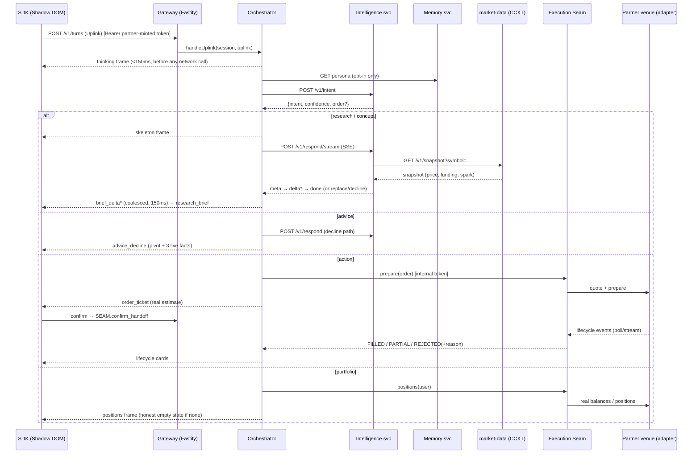

# Hippo — Development Documentation (as-built)

**Snapshot:** July 20, 2026 · `hippo-app@main` @ `19e79f5` · Phases 0–3 core merged; execution seam, partner admin portal, and the Assetworks test host all live.
**What this is:** a technical reference to what's *actually running*, verified against the current code, the port map, and a full test run this session — not the plan. For the forward spec see [[00 Build Plan Overview]]; for phase-by-phase ✅/🚧/⬜ status see [[Roadmap]] or [[Hippo Dev Progress]] (visual roadmap + kanban). For the current production-hardening handoff see [[🟢 Live Demo Status]]; for the live cloud footprint see the deployment note.

> **Editing surface vs. mirror:** this vault (iCloud Obsidian) is the canonical editing surface. `hippo-app/docs/vault` is a read-only git mirror refreshed by `scripts/sync-vault.sh` — edit here, then sync to version the change in the repo.

## Verified build health (this session)

```
pnpm test  → 17 turbo tasks green · 504 tests across 13 packages
             sdk 143 · cli 135 · gateway 83 · admin 34 · seam 27 · memory 22
             protocol 17 · stores 15 · portal 13 · market-data 7 · host-venue 6
             admin-ui 1 · portal-ui 1
intelligence (Python, mock provider) → 93 passed
             (test_cache_redis.py is a Redis-integration test; it ImportErrors
              locally because no redis client is installed — not a real failure)
evals harness (Python, stdlib)        → 41 passed (+27 subtests)
```
**638 tests passing.** The JS/TS workspace is Turbo-orchestrated (`turbo run test`); the two Python services (`services/intelligence`, `evals/`) sit deliberately outside the JS graph and are run directly from `services/intelligence/.venv`.

## Architecture — one turn, end to end



If the intelligence service times out or errors, the orchestrator emits one `banner(degraded)` per session per episode, classifies with a deterministic `guessIntent` fallback, and still answers research turns from `market-data` alone — degraded but truthful. Orders, prices, and portfolio never depend on the intelligence service. The seam and memory are likewise isolated: a memory miss falls back to no-persona; a seam/venue error surfaces as a translated rejection, never a bare stack trace.

## System map — services, apps, packages (current code)

**Backend services** (`services/*`, each its own process/port):

| Service | Port | What it is |
|---|---|---|
| `mock-gateway` | 8787 | Fastify + SSE golden-conversation player (dev/demo/CI) — the fast path for SDK-only work |
| `gateway` | 8788 | **Production.** Sessions/JWT, SSE journal + Last-Event-ID resume, orchestrator state machine, rate limit, telemetry/OTel |
| `market-data` | 8790 | CCXT snapshot/live pricing, fixtures + tests |
| `intelligence` | 8791 | Python/FastAPI — intent + research engines, answer cache, output-side guardrail, SSE |
| `memory` | 8792 | **Wired now.** Opt-in persona store over Postgres; HTTP surface; read on turn start, write on opt-in/follow/thread |
| `seam` | 8793 | **Execution seam** — canonical trading interface + per-venue adapters (sim / koinbx / assetworks) |
| `admin` | 8794 | Operator console API — partner CRUD, plans, sessions, audit; durable Postgres stores |
| `portal` | 8795 | Partner-scoped self-serve API — invite/claim/login, MAU vs quota, embed tag, secret rotation, plan requests, audit |
| `host-venue` | 8796 | **Assetworks test venue** — self-contained venue on the KoinBX-shaped signed wire + fill engine (test host to parasite onto) |

**Frontend apps** (`apps/*`):

| App | Port | What it is |
|---|---|---|
| `host-demo` | 4000 | Vanilla host page — serves the SDK `/loader.js` the embed loads + a zero-dep smoke shell |
| `assetworks-exchange` | 4001 | **Next.js 15 host** — the first-class Assetworks Exchange product; full trading surface + Hippo embed. Clean boundary: imports zero Hippo packages |
| `site` | 5174 | Marketing/site |
| `admin` | 5175 | Operator console UI (Vite SPA) → `admin` API |
| `portal` | 5176 | Partner portal UI (Vite SPA) → `portal` API |

**Packages** (`packages/*`): `protocol` (Zod card protocol v1 + canonical order model), `sdk` (Preact thin client), `stores` (Postgres-backed durable stores shared by gateway/admin/portal/memory).

Run the whole thing with `pnpm dev` (Turbo, concurrency 20) — it loads `.env` and brings up every service + app. `pnpm build` / `pnpm test` cover the JS graph; `biome check .` lints (the vendored `docs/vault` mirror and `apps/assetworks-exchange` are excluded — the latter uses its own Next lint).

## Card protocol v1 (`packages/protocol`)

Additive-only Zod schemas; every down-frame carries an optional `fallback: {text, href?}` so an SDK that doesn't recognize a frame type still renders something. `PROTOCOL_VERSION = 1`.

- `frames.ts` — down-frames incl. `brief_delta` (streaming counterpart to `research_brief`; the gateway coalesces consecutive deltas into one growing card, and the final `research_brief` is authoritative and supersedes them — the SDK never reconciles partial vs. final itself).
- `uplinks.ts` — up-frames (turns, confirm, cancel, feedback, stop).
- `orders.ts` — **the canonical order model.** A discriminated union over `spot | futures_perp | options`, with all money represented as **strings** (never floats), and `VenueCapabilities` where presence means enabled. This is the venue-neutral contract the seam prepares against and the codegen target for the CLI installer.

## Gateway (`services/gateway`)

**Wire surface** — identical to `mock-gateway`, so the SDK never knows which one it's talking to: `POST /v1/session`, `GET /v1/stream` (SSE), `POST /v1/turns`, plus confirm/cancel/stop uplinks, `GET /health`, and `/internal/*` (metrics; `/internal/venue-events` for seam lifecycle callbacks, now auth-guarded).

**Auth (`plugins/auth.ts`)** — JWT mode verifies an HS256 token against a per-partner shared secret and binds the session to `venue_user_id`. **Dev mode is now opt-in**: `HIPPO_DEV=1` is required to accept a bare `partnerKey`; anything else (including unset) fails closed to JWT-only, and the dev-partner secret fails loud if absent. Production hardens to JWKS/RS256 per partner.

**SSE journal (`plugins/sse.ts`)** — frames land in the journal *before* the stream connects, so `onStreamConnect` → replay-then-live is the single delivery path for everything, live or reconnected. Supports Last-Event-ID resume.

**Rate limit (`plugins/rate-limit.ts`)** — zero-dependency limiter on `/v1/session` and `/v1/turns` (audit blocker #8a).

**Orchestrator (`orchestrator/index.ts`)** — a plain TS state machine, deliberately not an agent framework (routing is deterministic; only the model calls are model-driven). Per turn: validate uplink → emit `thinking` immediately (<150ms budget) → optional persona read from `memory` → call intent → route:

| Intent | Behavior |
|---|---|
| `research` / `concept` | `skeleton` → `intelligence` `/v1/respond/stream` → `brief_delta`* (carrying the live model tag) → `research_brief` |
| `advice` | `/v1/respond` (decline path) → `advice_decline` |
| `action` | seam `prepare(order)` → `order_ticket` (**real estimate**) → confirm handoff → lifecycle cards |
| `portfolio` | seam `positions(user)` — **real venue state**, honest empty state when there's nothing |
| `smalltalk` / low-confidence (<0.4) | short `research_brief`-style nudge |

Degraded mode is the SLA contract: one banner per session per episode, market-data-only answers, orders/prices/portfolio stay live regardless of intelligence-service health.

## Intelligence service (`services/intelligence`)

Python 3.12+ / FastAPI, deliberately outside the JS workspace so it stays swappable between Ollama (dev), vLLM (prod), and a deterministic mock (the service never 500s because a model is down — `/health` reports the honest `mode`, and a 30s breaker skips a dead endpoint between retries).

- **`POST /v1/intent`** — regex fast-paths for explicit orders/portfolio/obvious advice-bait skip the LLM (p95 < 300ms); ambiguous text goes to a strict-JSON LLM prompt with one retry then rule fallback. Vague orders ("sell half my sol") return `intent=action` **without** an `order` object — the gateway must ask for an explicit size, never guesses.
- **`POST /v1/respond`** / **`/v1/respond/stream`** — returns a `brief` (stats/sparkline/sources come *deterministically from the market-data snapshot, never the model* — numbers are retrieval, prose is generation) or a `decline`. Streaming emits `meta` (snapshot facts, before any model token) → `delta`* (prose from constrained JSON via `JsonProseExtractor`) → `done`/`replace`/`decline`. Measured on `qwen3:4b`: first byte ~4ms, full brief ~5s; cache hits return `meta`+`done` in <800ms.
- **Guardrail** — three layers mirroring the eval harness exactly: intent-level, prompt-level (`HIPPO_SYSTEM_PROMPT_V0`, copied verbatim from `evals/runner/prompts.py` — evals are the source of truth), output-side (regex advice detector ported 1:1 from `evals/runner/scoring.py`; one trip regenerates sterner, a second replaces with `decline`).
- **Answer cache** — key = (canonical question, symbol+language, 5-min market window); TTL volatility-scaled (300s calm / 120s normal / 45s volatile from the brief's own spark line). In-memory locally; Redis-backed in production (`test_cache_redis.py` is the integration test for that path). This is the unit-economics lever from the strategy memo; hit rate is a first-class metric.
- **Production path** — swap `LLM_BASE_URL`/`LLM_MODEL`/`LLM_API_KEY` only. In cloud today it runs `mode=llm` against `anthropic/claude-haiku-4.5` via OpenRouter; the streamed model tag is forwarded all the way to `brief_delta` frames.

## Memory service (`services/memory`) — now wired

Persona store per Build Plan 03 ("persona, not surveillance"): opt-in flag, experience level, followed assets (capped 8), open conversation threads (capped 3) — deliberately **not** trade history, balances, or a behavioral profile. Keyed per-partner **and** per-user, so partner A's Hippo never sees what the same person asked on partner B.

Since July 15 this went from an in-memory `PersonaStore` with no surface to a **running service (8792) over Postgres**, wired into the gateway orchestrator (persona read on turn start, write on opt-in/follow/thread). The PII routes require the internal API token (audit blocker #7). `clear()` wipes persona data but preserves the opt-in flag — clearing isn't opting out, a deliberate product distinction. 22 tests.

## Execution Seam & adapters (`services/seam`) — built

The seam is the venue-neutral execution boundary described in [[04 Execution Seam & Partner Adapter]]. It exposes the Canonical Trading Interface (quote / prepare / confirm_handoff / status / stream_events / cancel / open_orders / positions / balances / instruments / map_rejection) and dispatches to a per-venue **adapter** selected at boot by `VENUE=`:

| `VENUE` | Adapter (`src/*`) | What it talks to |
|---|---|---|
| `sim` | `sim-venue.ts` | In-process simulator — serves **real** portfolio state, fabricates nothing |
| `koinbx` | `koinbx-venue.ts` | KoinBX-shaped signed trade wire (HMAC-SHA256 over body+timestamp) |
| `assetworks` | `assetworks-venue.ts` | The Assetworks test host (`host-venue`) — near-clone of the koinbx adapter |

Each adapter fails loud if its `*_API_KEY`/`*_SECRET`/`*_BASE_URL` are missing. The seam's trading surface is guarded by a timing-safe internal token and fails closed (audit blocker #2); `callbackUrl` is constrained by the `SEAM_CALLBACK_ALLOWED_ORIGINS` SSRF allowlist (blocker #6). It reconciles orders by `clientOrderId` and supports **both confirm surfaces**, read live from the venue's admin config: `api` (Hippo places directly) and `js_callback` (the host renders its own confirm modal and places on approval). 27 tests.

## Assetworks test host (`services/host-venue` + `apps/assetworks-exchange`) — new

A full-fidelity venue to parasite Hippo onto for realistic testing — the thing a real partner exchange would be.

- **`services/host-venue` (8796)** — a self-contained venue speaking the KoinBX-shaped signed wire (`hmac.ts`: `hex(HMAC-SHA256(bodyJSON+timestamp, secret))`) with a fill engine for **spot + perps** (market orders rest a "working window" ≥ the seam poll interval so the reconciler resolves `FILLED`, not "expired"; limit orders rest until live price crosses; funds reserved at placement), an SSE `/stream`, `/v1/capabilities`, and an admin `/admin/config` with a **live confirm-surface switch**. The human order ticket and the Hippo parasite share one `trader-1` book, so a Hippo-placed order shows up in the host's own native blotter. 6 tests.
- **`apps/assetworks-exchange` (4001)** — the host UI, and a **first-class product Victor keeps building**, so it uses AssetWorks' own stack for portability: Next.js 15 App Router + Tailwind v4 (`aw-*` tokens, theme-responsive), shadcn-style `AW*` components, Zustand, ECharts candles, a public-WS `BinanceStream`, and a `/venue/*` Next rewrite proxy to `host-venue`. Full surface: streaming chart/book/tape, spot + futures ticket (leverage/margin/reduceOnly), live blotter over venue SSE, admin drawer, host `js_callback` confirm modal, and the Hippo `/loader.js` embed.
- **Clean-boundary rule (enforced):** the app imports **zero** Hippo packages. The only two links are the host-venue HTTP wire and the single embed `<script>`. It's excluded from the repo's biome config precisely so it stays a portable, standalone AssetWorks product.

The vanilla `apps/host-demo` (4000) still exists — it serves the SDK `/loader.js` the embed loads plus a zero-dep smoke shell — but the Next app is now the primary host. Spot is the wired conversational-parasite path; perps are placeable today via the host UI ticket, and wiring perps end-to-end through the seam `PrepareRequest` is the next capability task.

## Partner admin & portal (`services/admin`, `services/portal`, `packages/stores`) — new

- **`packages/stores`** — the durable persistence layer shared across services: Postgres access (`db.ts`, `migrate.ts`), plus `partner-store`, `admin-store`, `partner-admin-store`, `user-store`, `mau-store`, `plan-store`, and crypto helpers (`jwt.ts`, `password.ts` scrypt). 15 tests. This is what moved the system off the old in-memory stubs.
- **`services/admin` (8794) + `apps/admin` (5175)** — the operator console: partner CRUD, plan assignment, a sessions page, and audit. Scrypt password hashing, httpOnly session cookies. 34 tests (+1 UI smoke).
- **`services/portal` (8795) + `apps/portal` (5176)** — the partner-scoped self-serve portal, tenant-isolated **by construction** (`partnerId` only ever comes from the session, never the request body): operator invite → one-time claim → login (own cookie namespace `hippo_portal`, HttpOnly, Strict); own data only (MAU vs quota/users); integration surface (embed tag, config, one-time secret rotation); plan view + change request; own audit. 13 tests (+1 UI smoke).

## SDK (`packages/sdk`)

Preact, closed Shadow DOM, two-stage loader (~1.1KB gz first stage). Renderer (`cards.tsx`), panel shell (`panel.tsx`), reactive state (`state.ts`, Preact signals), SSE transport (`transport.ts`), plus onboarding, share overlay, feedback chips, order-pill expand, freshness, and posture. 143 tests. Highlights since July 15:

- **Partner-token session mint (blocker #4, PR #27)** — a `data-hippo-token-url` embed attribute makes the SDK fetch a fresh token from the partner's own endpoint per mint and send it as `Authorization: Bearer`. The reference partner mint is `apps/host-demo/api/token.ts` (a Vercel function; cookie `sub`, 15-min expiry). The gateway is unchanged — this is purely how the browser proves who the end-user is without the partner embedding a long-lived secret.
- **Resilience batch** — refresh-in-place, a stream watchdog, an outbox flush for uplinks that raced a disconnect, action-failure feedback, session re-mint, and distinct **blocked** vs **capacity** states when a mint fails (no more generic error).
- **Honest empty states** — positions and blotter render nothing rather than fabricating rows to fill the card.
- Posture is a working 3-state machine (`min | dock | max`); i18n Phase 1 scaffolding is in, with Arabic chrome copy dormant until a partner sets `ar` (native review gates activation).

## The trust boundary (auth hardening)

The July-18 prod-readiness audit found the product loop worked end to end but internal services trusted each other via unimplemented mTLS. That gap is now closed at Tier-1 (see [[🟢 Live Demo Status]] for the blocker ledger):

- **Internal API token**, timing-safe and fail-closed, guards the seam trading surface (#2), the gateway `/internal/venue-events` callback (#3), and the memory persona PII routes (#7).
- **`SEAM_CALLBACK_ALLOWED_ORIGINS`** SSRF allowlist on seam `callbackUrl` (#6).
- **Gateway rate limit** on `/v1/session` + `/v1/turns` (#8a).
- **`HIPPO_DEV` is now opt-in** (`===1`) and the dev-partner secret fails loud (#1) — local `.env` must set `HIPPO_DEV=1` and `INTERNAL_API_TOKEN` or the demo loop 401s/503s on restart.
- **Non-ephemeral admin/portal JWT secrets + Secure-by-default cookies (#9, PR #25)** — admin and portal now refuse to boot in production without distinct `ADMIN_JWT_SECRET` / `PORTAL_JWT_SECRET` (previously per-boot `randomBytes`, which logged everyone out on each redeploy); cookies are `Secure` by default in prod.

Still open past a single-instance demo: Tier-2 durability (durable ticket routing + durable seam audit, next migration `009`), the portal/admin half of the rate limit, the client-side JWT path fully generalized, and rotating the live OpenRouter key.

## Market data, CLI, evals

- **`services/market-data`** — CCXT snapshot/live pricing + fixtures, 7 tests.
- **`tools/cli` (`@hippo/cli`)** — the agentic installer. `hippo scan` (read-only CSP/robots/capability + trade-type discovery → Markdown integration report), plus `register` (provisioning), `embed`, and `verify` stages. 135 tests. Model-driven adapter codegen is the remaining stage.
- **`evals/`** — 300-query bake-off set v1 (90 market_event / 60 asset_research / 60 concept / 30 portfolio_context / 60 advice_bait; 183 en / 92 hinglish / 25 hi), stdlib runner, 41 harness tests. The gate report against the *mock* provider correctly fails the advice-avoidance threshold (mock isn't guardrail-tuned); the real bake-off run to score Phase 2's exit gate still needs a GPU.

## Deployment (as-built)

Live cloud footprint runs on **Railway** (services, per-service Dockerfiles in `deploy/docker/`) and **Vercel** (frontends). Gateway/admin/portal/market-data/seam/intelligence/memory are Online; Postgres has all 8 migrations applied; intelligence runs `mode=llm` on `claude-haiku-4.5` via OpenRouter. Full URLs, env vars, secret recovery, and the smoke recipe live in the deployment note and `DEPLOY.md` / `scripts/smoke.sh` (13/13 green). The new `host-venue` service and `assetworks-exchange` app are **not** yet wired to Railway/Vercel, so pushing them to main does not auto-deploy them.

## What's next (grounded in the gaps above)

1. Wire the conversational-parasite **perps** path end to end — extend the seam `PrepareRequest`, have intelligence emit `FuturesPerpOrder`, and pass it through the gateway.
2. **Tier-2 durability** — durable ticket routing (#4) + durable seam audit (#5), next migration `009`.
3. Model-driven **adapter codegen** in the CLI (the last installer stage).
4. Real **bake-off** run against a larger baseline once GPU access lands (Phase 2 exit gate).
5. Deploy `host-venue` + `assetworks-exchange` (Railway/Vercel config) and rotate the live OpenRouter key.

Related: [[00 Build Plan Overview]] · [[04 Execution Seam & Partner Adapter]] · [[10 BE Architecture]] · [[12 Partner Admin Portal]] · [[🟢 Live Demo Status]] · [[Roadmap]] · [[Open Decisions]] · [[Hippo Dev Progress]]
