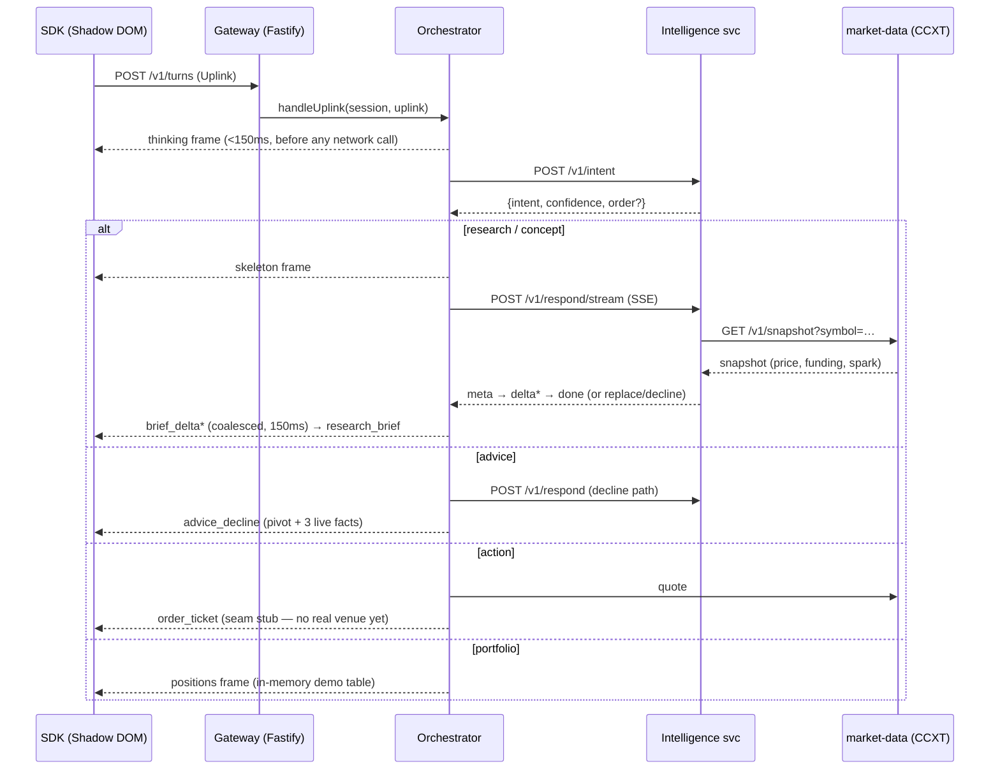

# Hippo — Development Documentation (as-built)

**Snapshot:** July 15, 2026 · `hippo-app@main` @ `a281b88` · PRs #1–#9 merged · `services/memory` in progress, uncommitted on disk.
**What this is:** a technical reference to what's *actually running*, verified against the code and a live test run this session — not the plan. For the forward spec see [[00 Build Plan Overview]]; for phase-by-phase ✅/🚧/⬜ status see that same doc's *Phasing* section or [[Hippo Dev Progress]] (visual roadmap + kanban).

## Verified build health (this session)

```
pnpm test   → 8/8 packages green, 131 tests (sdk 35 · gateway 34 · cli 38 · protocol 8 · market-data 7 · memory 9)
intelligence (Python, mock provider) → 86/86 tests
evals harness (Python, stdlib)       → 41/41 tests
```
258 tests total, all passing. `pnpm install` had to be re-run once this session — the new `services/memory` package wasn't reflected in Turbo's workspace graph until then (harmless; `pnpm-workspace.yaml`'s `services/*` glob already covers it).

## Architecture — one turn, end to end



If the intelligence service times out or errors, the orchestrator emits one `banner(degraded)` per session per episode, classifies with a deterministic `guessIntent` fallback, and still answers research turns from `market-data` alone — degraded but truthful. Orders, prices, and portfolio never depend on the intelligence service.

## Repo layout — corrected against the current code

The root `README.md` still calls `services/gateway` a "skeleton" — it isn't anymore as of PR #7. Current state:

| Path | What it is now |
|---|---|
| `packages/protocol` | Card protocol v1 — Zod schemas. `frames.ts` (down-frames incl. `brief_delta` for streaming), `uplinks.ts` |
| `packages/sdk` | Preact SDK, closed Shadow DOM. `loader.ts` (two-stage), `panel.tsx`/`cards.tsx` (renderer, 3-state posture: `min`/`dock`/`max`), `transport.ts` (SSE client), `onboarding.ts`, `overlays.tsx`, `share.ts`, `feedback.ts`, `orders-expand.ts`, `freshness.ts`, `state.ts`, `styles.ts` |
| `services/gateway` | **Production, not a skeleton.** Real sessions (`plugins/auth.ts`), SSE frame journal with Last-Event-ID resume (`plugins/sse.ts`), the orchestrator card state machine (`orchestrator/index.ts`, 544 lines), telemetry counters (`plugins/telemetry.ts`) |
| `services/intelligence` | Python/FastAPI. Intent engine, research engine, answer cache, output-side guardrail, SSE streaming. Own `README.md` is the best single source on this service |
| `services/market-data` | CCXT-backed snapshot/live pricing, fixtures + tests |
| `services/mock-gateway` | Fastify + SSE golden-conversation player (dev/demo/CI) — unchanged, still the fast path for SDK-only work |
| `services/memory` | **New, uncommitted.** `store.ts` — in-memory `PersonaStore` (opt-in, experience level, followed assets, open threads), per-partner+per-user scoped. Has passing tests (`test/memory.test.ts`, 9/9) but **no HTTP surface yet and not wired into the gateway orchestrator** |
| `apps/host-demo` | Fake exchange terminal, embeds the SDK via one script tag |
| `tools/cli` | `hippo scan v0` — read-only site/API discovery → Markdown integration report |
| `evals/` | 300-query bake-off set v1 + stdlib Python runner, mock/live modes, launch gates |

## Card protocol v1 (`packages/protocol`)

Additive-only Zod schemas; every down-frame carries an optional `fallback: {text, href?}` so an SDK that doesn't recognize a frame type still renders something. `PROTOCOL_VERSION = 1`.

Frames now include **`brief_delta`** (added in PR #9): the streaming counterpart to `research_brief`. The gateway coalesces consecutive deltas into one growing card client-side; the eventual `research_brief` frame is authoritative and supersedes them — the SDK never has to reconcile partial vs. final state itself, it just replaces on receipt.

## Gateway (`services/gateway`)

**Wire surface** — identical to `mock-gateway`, so the SDK never knows which one it's talking to: `POST /v1/session`, `GET /v1/stream` (SSE), `POST /v1/turns`, `GET /health`, plus `GET /internal/metrics` (dev-only in-memory counters; OTel replaces this in pods).

**Auth (`plugins/auth.ts`)** — two modes: dev mode (default, `HIPPO_DEV≠'0'`) accepts a bare `partnerKey`; JWT mode verifies an HS256 token against a per-partner shared secret and binds the session to `venue_user_id`. One dev partner ships in-memory: `koinbx-dev` / `pk_demo`. Production hardens to JWKS/RS256 per partner.

**SSE journal (`plugins/sse.ts`)** — frames land in the journal *before* the stream connects, so `onStreamConnect` → replay-then-live is the single delivery path for everything, live or reconnected. Supports Last-Event-ID resume.

**Orchestrator (`orchestrator/index.ts`)** — a plain TS state machine, deliberately not an agent framework (routing is deterministic; only the model calls are model-driven). Per turn: validate uplink → emit `thinking` immediately (<150ms budget, before any network call) → call intent → route:

| Intent | Behavior |
|---|---|
| `research` / `concept` | `skeleton` → `services/intelligence` `/v1/respond/stream` → `brief_delta`* → `research_brief` |
| `advice` | `/v1/respond` (decline path) → `advice_decline` |
| `action` | market-data quote → `order_ticket` (**seam stub** — Phase 3 execution seam not built, no real venue) |
| `portfolio` | `positions` frame from an in-memory demo table (seam stub) |
| `smalltalk` / low-confidence (<0.4) | short `research_brief`-style nudge |

Degraded mode (see architecture diagram above) is the SLA contract: one banner per session per episode, market-data-only answers, orders/prices/portfolio stay fully live regardless of intelligence-service health.

## Intelligence service (`services/intelligence`)

Python 3.12+ / FastAPI, deliberately outside the JS workspace (`pnpm build`/`test` never touch it) so it stays swappable between Ollama (dev), vLLM (prod), and a deterministic mock (the service never 500s because a model is down — `/health` reports the honest `mode`, and a 30s breaker skips a dead endpoint between retries).

- **`POST /v1/intent`** — regex fast-paths for explicit orders/portfolio/obvious advice-bait skip the LLM (p95 < 300ms); ambiguous text goes to a strict-JSON LLM prompt with one retry then rule fallback. Vague orders ("sell half my sol") return `intent=action` **without** an `order` object — the gateway has to ask for an explicit size, never guesses.
- **`POST /v1/respond`** / **`POST /v1/respond/stream`** — returns a `brief` (stats/sparkline/sources come *deterministically from the market-data snapshot, never the model* — numbers are retrieval, prose is generation) or a `decline` (advice intent, or the guardrail tripping twice). Streaming emits `meta` (snapshot facts, before any model token) → `delta`* (prose chunks extracted from constrained JSON via `JsonProseExtractor`) → `done` (authoritative) or `replace`/`decline`. Measured locally on `qwen3:4b`: first byte ~4ms, full brief ~5s; cache hits return `meta`+`done` in <800ms.
- **Guardrail** — three layers mirroring the eval harness exactly: intent-level (advice-bait never generates), prompt-level (`HIPPO_SYSTEM_PROMPT_V0`, copied verbatim from `evals/runner/prompts.py` — evals are the source of truth), output-side (regex advice-language detector ported 1:1 from `evals/runner/scoring.py`; one trip regenerates sterner, a second trip replaces with `decline`).
- **Answer cache** — key = (canonical question, symbol+language, 5-min market window); TTL volatility-scaled (300s calm / 120s normal / 45s volatile from the brief's own spark line). This is the unit-economics lever from the strategy memo — cache hit rate is exported on `/health` today, becomes a first-class OTel metric in production.
- **Production path** — swap `LLM_BASE_URL`/`LLM_MODEL`/`LLM_API_KEY` only, no code changes; intent stays on a regional 7–8B pod, research points at the global ~30B tier; cache/hit-rate counters move to Redis (in-memory impl is key-compatible by design).

## Memory service (`services/memory`) — new, in progress

Persona store per Build Plan 03 ("persona, not surveillance"): opt-in flag, experience level, followed assets (capped 8), open conversation threads (capped 3) — deliberately **not** trade history, balances, or a behavioral profile. Keyed per-partner **and** per-user, so partner A's Hippo never sees what the same person asked on partner B.

Current state: `InMemoryPersonaStore` (`get`/`update`/`clear`/`size`) with 9 passing tests. `clear()` wipes persona data but preserves the opt-in flag itself — clearing isn't opting out, a deliberate product distinction. **Not yet done:** no HTTP route/service entrypoint, not called from the gateway orchestrator, no Postgres-backed store for production (same `PersonaStore` interface, only the constructor changes per the doc comment).

## SDK (`packages/sdk`)

~2,000 lines across renderer (`cards.tsx`), panel shell (`panel.tsx`), two-stage loader (`loader.ts`), reactive state (`state.ts`, Preact signals), SSE transport (`transport.ts`), plus the interaction layer shipped in PRs #3/#6: onboarding hero + edge states, share overlay, feedback reason chips, order-pill expand, new-order hint.

Posture is a working 3-state machine — `'min' | 'dock' | 'max'` — not yet the full spec'd matrix (`dock`/`overlay`/`pill` on web + `pill`/`sheet`/`full-screen` on mobile web). No localization files exist anywhere in `src/` — EN/हिन्दी/Hinglish + RTL scaffolding hasn't started.

## Market data, CLI, evals

Unchanged in shape since last reviewed, all green:
- `services/market-data` — CCXT snapshot/live pricing + fixtures, 7 tests.
- `tools/cli` — `hippo scan v0`: read-only CSP/robots/capability detection → Markdown integration report with a High/Medium/Low verdict, 38 tests. Codegen/embed-injection stages (Phase 4) not started.
- `evals/` — 300-query v1 set (90 market_event/60 asset_research/60 concept/30 portfolio_context/60 advice_bait; 183 en/92 hinglish/25 hi), stdlib runner, 41 harness tests. The gate report the runner produces against the *mock* provider correctly fails the advice-avoidance threshold — expected, since mock isn't a guardrail-tuned model; the real bake-off run (needed to actually score Phase 2's exit gate) still needs a GPU.

## What's next (grounded in the gaps above, not the original plan order)

1. `services/memory` — HTTP surface + wire into the orchestrator (persona read on turn start, write on opt-in/follow/thread).
2. SDK: point the host-demo at the real `services/gateway` instead of `mock-gateway`; adopt the new `brief_delta` streaming path in the panel.
3. Full posture matrix + localization scaffolding (both still open from Phase 1).
4. Execution seam (Phase 3) — blocked on the A/B model decision in [[Open Decisions]].
5. Real bake-off run against a 70B baseline once GPU access lands.

Related: [[00 Build Plan Overview]] · [[Open Decisions]] · [[Hippo Dev Progress]]
